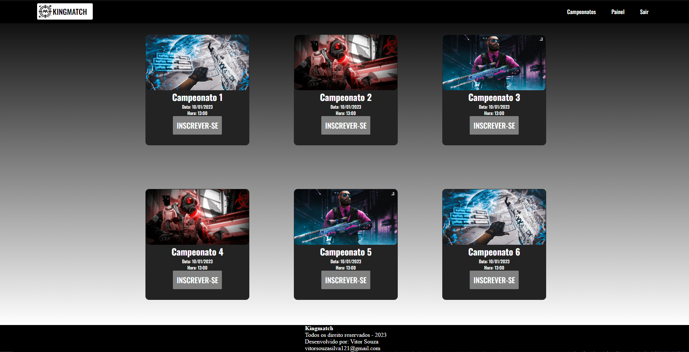
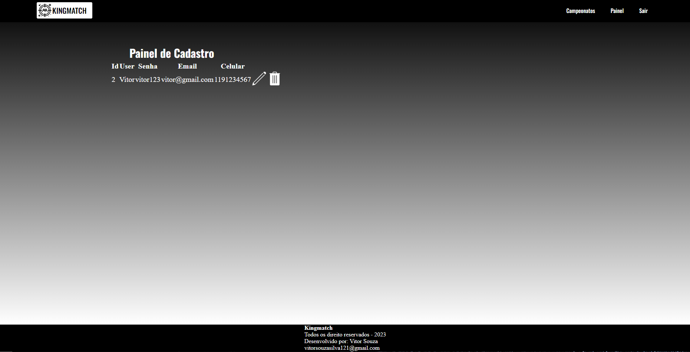
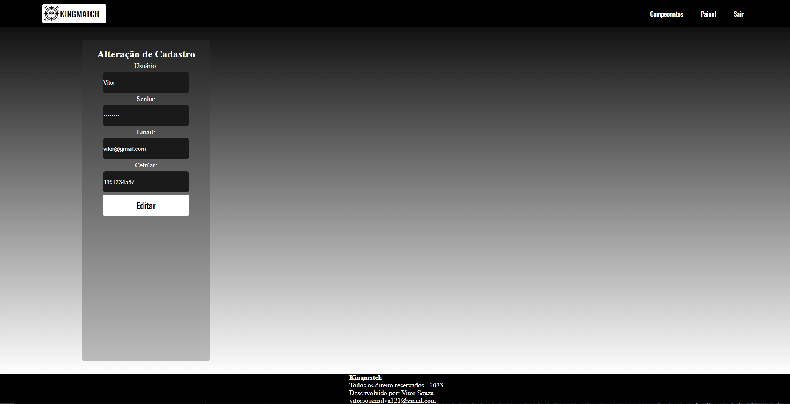

# 🕹 Kingmatch

Foi elaborado como projeto acadêmico para avaliação na faculdade, consistiu na criação de um site que utiliza os princípios da programação orientada a objetos em conjunto com o PDO do PHP. O objetivo principal foi desenvolver as operações básicas de um sistema CRUD, permitindo o cadastro, listagem, atualização e exclusão de registros.

## ⚙ Funcionalidade

O projeto compreende uma página inicial que oferece funcionalidades de login e registro. Após a validação do cadastro, o sistema redireciona o usuário para a página principal, onde seria realizado o registro de campeonatos. Além disso, inclui um painel de administração que permite a visualização, edição e exclusão dos registros cadastrados.

## 🧰 Tecnologias 

* PHP - Responsável pela estrutura da página e pela lógica de conexão com o banco de dados.
* CSS - Utilizado para a estilização das páginas.
* MySQL - Banco de dados local utilizado no projeto.
* Workbench - Implementado para visualização de registros e alterações (opcional).
* XAMPP - Utilizado para criar um ambiente de desenvolvimento web local.

## 🔌 Inicialização 

Para começar, siga os passos abaixo:

* Primeiramente é necessario instalar o XAMPP

* Localize a pasta **xampp** no disco C: do seu computador e encontre a pasta **htdocs**.

* Dentro dessa pasta, inclua o arquivo com o projeto.

* Em seguida, inicie o XAMPP e ligue o MySQL e o Apache.

* Abra o navegador e digite "localhost" na URL.

* Clique na pasta do projeto para abri-lo.

* Lembre-se de que o projeto está configurado para rodar na porta 3312, mas a sua porta pode ser a padrão, que é 3306. Portanto, se necessário, remova a linha de código na classe de Conexão que contém **";port=3312"**.

## 📷 Imagens 

Pagina de acesso

Pagina de cadastro

Pagina inicial 

Painel de cadastro onde é possivel atualizar e excluir o cadastro

Pagina de alteração de registros 

